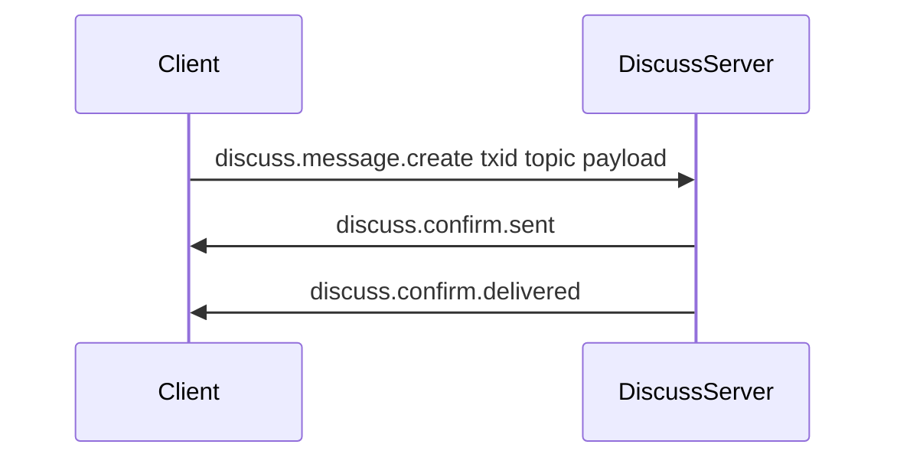
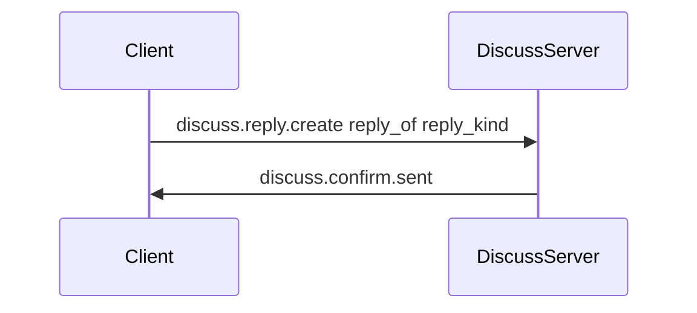
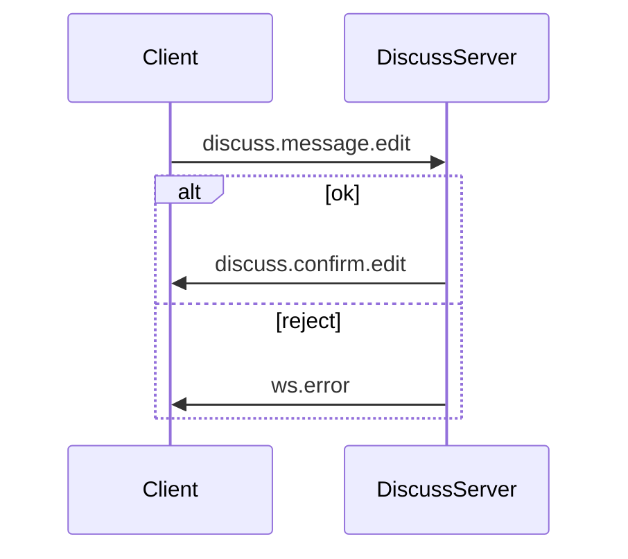
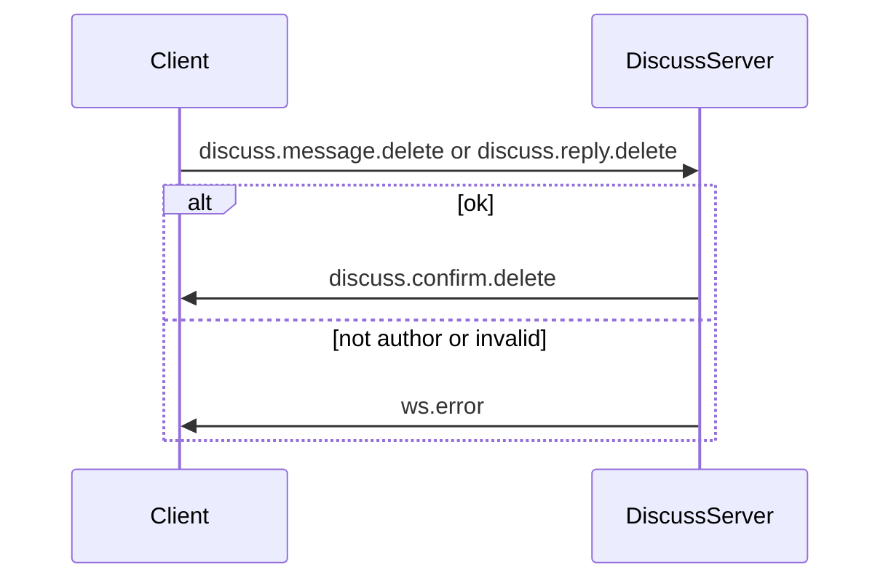

# RFX Discuss RTC message schema (server perspective)

This document specifies **WebSocket wire messages** for the `rfx_discuss` module using the shared [`ClientMessage`](../../lib/fluvius/transport/datadef.py) envelope. The **server** routes and persists discussion state; clients send and receive `ClientMessage` frames whose **`type`** field selects the operation. **`topic`** identifies the **discussion channel** (see below).

For transport plumbing (codec, bridge handlers, `ws.error`), see [`rtc_bridge.py`](../../lib/fluvius/transport/rtc_bridge.py).

---

## Envelope: `ClientMessage`

Every RTC frame uses this shape (browser-visible subset):

| Field       | Type     | Server role |
|------------|----------|-------------|
| `txid`     | `string` | Correlates a client request with server replies; echoed on confirmations and errors when applicable. Clients should send a **unique `txid` per logical operation**; the server may use it for **idempotency and deduplication** (no separate payload field). |
| `type`     | `string` | Selects the message operation (discuss types below, plus bridge-level types such as `ws.error`). |
| `topic`    | `string` | **Discussion channel id** for this conversation stream. All messages with the same `topic` belong to the **same** discussion channel. |
| `payload`  | `object` | Operation-specific body; validated by the registered handler model when the bridge enforces a schema. |
| `timestamp`| `datetime` | Wire timestamp; set by the stack when encoding. |

Encoding uses the RTC wire codec configured for `ClientMessage` (`encode_client` / `decode_client` in `rtc_codec`).

---

## Channel and topic semantics

- **Discussion channel** — Logical partition for one ongoing discussion. In this spec it is keyed by **`topic`**: every `ClientMessage` carrying the same `topic` is part of the **same** channel.
- **RTC topic** — The string placed in `ClientMessage.topic`. Multiple WebSocket sessions may use the same topic to participate in the same channel; the server authorizes who may subscribe or post (`authorize_message` / `authorize_channel` in the bridge).
- **Action** — Distinguished solely by **`type`**; `topic` does not vary per action within one channel.

---

## Core entities

| Entity | Description |
|--------|-------------|
| **Channel** | Identified by `topic`. Contains many **root messages**. |
| **Root message** | A top-level post in the channel. |
| **Reply** | Attached to a root message (or to the thread under it). **All replies are flat**: there is no nested reply-of-reply; each reply references its parent root message (and optionally a stable **reply id** for edits/acks). |
| **Reply body** | Either a **message** (user content) or an **acknowledgement** (e.g. reaction, receipt-style signal—domain-specific). |

---

## `type` naming

Discuss-specific `type` values use the prefix `discuss.` so they can be registered on `RTCBridge.on_message` without colliding with built-in types (`ping`, `echo`, …). Implementations may tighten payload models per handler.

---

## Incoming message types (client → server)

These are **requests** the server accepts when the corresponding handler is registered.

### New root message in a channel

- **`type`:** `discuss.message.create`
- **Purpose:** Append a new root message to the channel identified by `topic`.
- **Idempotency:** Use envelope **`txid`** (not a field in `payload`) so the server can deduplicate retries.

```python
# type: discuss.message.create
{
    "body": "string",           # message body (format per product rules)
    # optional: "metadata": { ... }
}
```

### New reply in a channel

- **`type`:** `discuss.reply.create`
- **Purpose:** Append a **flat** reply under a root message. Reply kind is indicated by payload.

```python
# type: discuss.reply.create
{
    "reply_of": "uuid",            # root message this reply belongs to
    "reply_kind": "message",       # "message" | "acknowledgement"
    # If reply_kind == "message":
    "body": "string",
    # If reply_kind == "acknowledgement":
    # "acknowledgement": { ... }   # domain-specific ack payload
}
```

### Ownership (edit and delete)

**Edit** and **delete** apply only to **your own** content: the authenticated sender must be the **author** of the root message or reply (identity comes from the session or product-defined auth). The server rejects attempts to edit or delete another user’s messages or replies (for example `ws.error` with a permission-related **`errcode`**).

### Edit a root message

- **`type`:** `discuss.message.edit`
- **Purpose:** Change content of an existing root message in this channel (author only; see **Ownership** above).

```python
# type: discuss.message.edit
{
    "message_id": "uuid",
    "body": "string"
}
```

### Edit a reply

- **`type`:** `discuss.reply.edit`
- **Purpose:** Change content of an existing reply (message-type or acknowledgement-type, per stored kind; author only).

```python
# type: discuss.reply.edit
{
    "reply_of": "uuid",
    "reply_id": "uuid",
    "body": "string",              # or acknowledgement object, matching kind
}
```

### Delete a root message

- **`type`:** `discuss.message.delete`
- **Purpose:** Remove a root message from this channel (author only). Product policy may **soft-delete** (tombstone, “message removed”) or hard-delete; either way, clients learn via **`discuss.confirm.delete`** (and any fan-out rules you define for replies under that root).

```python
# type: discuss.message.delete
{
    "message_id": "uuid",
}
```

### Delete a reply

- **`type`:** `discuss.reply.delete`
- **Purpose:** Remove an existing reply (author only).

```python
# type: discuss.reply.delete
{
    "reply_of": "uuid",
    "reply_id": "uuid",
}
```

### Acknowledgement for a root message

- **`type`:** `discuss.message.ack`
- **Purpose:** Attach or update an acknowledgement on a **root message** (not a reply), when the product distinguishes this path from `discuss.reply.create` with `reply_kind: acknowledgement`.

```python
# type: discuss.message.ack
{
    "message_id": "uuid",
    "acknowledgement": { ... }     # domain-specific
}
```

**Server validation (typical):** `topic` required; ids must resolve inside the channel implied by `topic`; authorize sender for channel and target entities; **edit and delete only for content authored by the sender**; enforce reply flatness (no parent pointing to another reply as nested thread).

---

## Outgoing message types (server → client)

Replies are **`ClientMessage`** instances, usually with the same **`topic`** as the triggering channel and **`txid`** echoed from the client request when applicable.

### Sent confirmation

- **`type`:** `discuss.confirm.sent`
- **Purpose:** Server has accepted and persisted the new/edited entity (or queued it reliably). Not used for a successful **delete**; use **`discuss.confirm.delete`** instead.

```python
# type: discuss.confirm.sent
{
    "target": "message",         # "message" | "reply"
    "message_id": "uuid",        # root id for message path
    "reply_id": "uuid|null",     # set when target is reply
}
```

### Delivered confirmation

- **`type`:** `discuss.confirm.delivered`
- **Purpose:** Server indicates delivery to recipients (e.g. fan-out complete to channel subscribers). Exact semantics are product-defined.

```python
# type: discuss.confirm.delivered
{
    "target": "message|reply",
    "message_id": "uuid",
    "reply_id": "uuid|null",
}
```

### Read confirmation

- **`type`:** `discuss.confirm.read`
- **Purpose:** Read receipt for a message or reply (who read what).

```python
# type: discuss.confirm.read
{
    "target": "message|reply",
    "message_id": "uuid",
    "reply_id": "uuid|null",
    "reader_id": "string",       # or anonymous token per privacy rules
    "read_at": "iso8601"
}
```

### Edit succeeded (message or reply)

- **`type`:** `discuss.confirm.edit`
- **Purpose:** Edit applied successfully.

```python
# type: discuss.confirm.edit
{
    "target": "message|reply",         # "message" | "reply"
    "message_id": "uuid",
    "reply_id": "uuid|null",
    "updated_at": "iso8601"
}
```

### Delete succeeded (message or reply)

- **`type`:** `discuss.confirm.delete`
- **Purpose:** Delete applied successfully; fan out to channel subscribers so UIs remove or mark the entity per product rules.

```python
# type: discuss.confirm.delete
{
    "target": "message|reply",   # "message" | "reply"
    "message_id": "uuid",
    "reply_id": "uuid|null",
    "deleted_at": "iso8601"
}
```

### Acknowledgement succeeded

- **`type`:** `discuss.confirm.ack`
- **Purpose:** Ack persisted for the root message.

```python
# type: discuss.confirm.ack
{
    "message_id": "uuid",
    "acknowledgement": { ... }
}
```

### Error message

Errors use the bridge’s wire type **`ws.error`** (not `discuss.*`). Payload typically includes:

```python
# type: ws.error
{
    "errmsg": "string",
    "errcode": "string",         # e.g. WS101 permission, WS102 handler, WS104 unknown type
}
```

Discuss-specific validation failures may use the same envelope with **`errcode`** values defined by the discuss module (e.g. `DISC01` unknown channel).

---

## End-to-end flows

### Post root message and receive confirmations



### Post flat reply (message or acknowledgement)



### Edit and error path



### Delete message or reply (author only)



---

## Compatibility and extension

- **New fields** in `payload` should be optional for backward compatibility unless versioned otherwise.
- **New `discuss.*` types** should be documented here and registered in the RTC bridge so `/ws/schema` (when enabled) exposes payload JSON Schema.
- **Multi-tenant or private channels** — enforce in `authorize_message` / domain layer; this document only fixes wire shape and channel/topic grouping.

---

## Related code

- [`ClientMessage`](../../lib/fluvius/transport/datadef.py) — envelope definition
- [`RTCBridge`](../../lib/fluvius/transport/rtc_bridge.py) — dispatch, `ws.error`, handler registration
