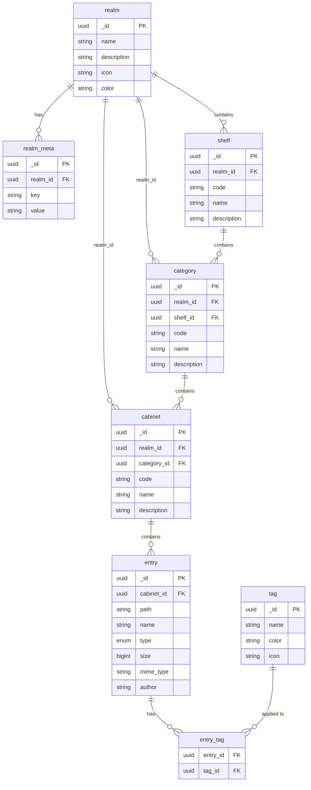

# BCS Document Manager — Data Model

## Conventions

### Primary keys

Every table has an `_id` column of type `UUID`, generated server-side (v4).

### Audit columns

Every table includes four audit columns:

| Column     | Type      | Description                        |
| ---------- | --------- | ---------------------------------- |
| `_created` | timestamp | Row creation time (UTC)            |
| `_updated` | timestamp | Last modification time (UTC)       |
| `_creator` | uuid      | User ID that created the row       |
| `_updater` | uuid      | User ID that last modified the row |

### Naming

- Table names are **singular** (e.g. `realm`, not `realms`).
- Foreign key columns use `<table>_id` (e.g. `realm_id`, `cabinet_id`).
- Human-readable codes (`A`, `A01`, `A01-001`) are stored in a `code` column — they are **not** primary keys.

---

## Entity-Relationship Diagram



---

## Tables

### 1. `realm`

Top-level organisational boundary (e.g. "Corporate", "Legal").

| Column        | Type      | Nullable | Constraints | Notes                              |
| ------------- | --------- | -------- | ----------- | ---------------------------------- |
| `_id`         | uuid      | no       | PK          |                                    |
| `name`        | string    | no       |             | e.g. "Corporate", "Legal"          |
| `description` | string    | yes      |             |                                    |
| `icon`        | string    | yes      |             | Lucide icon name, e.g. "Building2" |
| `color`       | string    | yes      |             | Theme color key, e.g. "blue"       |
| `_created`    | timestamp | no       |             |                                    |
| `_updated`    | timestamp | no       |             |                                    |
| `_creator`    | uuid      | no       |             |                                    |
| `_updater`    | uuid      | no       |             |                                    |

### 2. `realm_meta`

Key-value metadata scoped to a realm. Stores custom structural level labels (e.g. renaming "Shelf" to "Function") and arbitrary realm-level configuration.

| Column     | Type      | Nullable | Constraints                      | Notes                                                      |
| ---------- | --------- | -------- | -------------------------------- | ---------------------------------------------------------- |
| `_id`      | uuid      | no       | PK                               |                                                            |
| `realm_id` | uuid      | no       | FK → `realm._id`                 |                                                            |
| `key`      | string    | no       |                                  | e.g. "shelf_label", "category_label", "cabinet_label"      |
| `value`    | string    | no       |                                  | e.g. "Function", "Activity", "Transaction"                 |
| `_created` | timestamp | no       |                                  |                                                            |
| `_updated` | timestamp | no       |                                  |                                                            |
| `_creator` | uuid      | no       |                                  |                                                            |
| `_updater` | uuid      | no       |                                  |                                                            |

**Unique constraint:** `(realm_id, key)`

#### Reserved keys

| Key              | Description                            | Example value   |
| ---------------- | -------------------------------------- | --------------- |
| `shelf_label`    | Display label for the shelf level      | "Function"      |
| `category_label` | Display label for the category level   | "Activity"      |
| `cabinet_label`  | Display label for the cabinet level    | "Transaction"   |

### 3. `shelf`

First structural level. Identified by a single-letter code (A–Z) within a realm.

| Column        | Type      | Nullable | Constraints     | Notes                           |
| ------------- | --------- | -------- | --------------- | ------------------------------- |
| `_id`         | uuid      | no       | PK              |                                 |
| `realm_id`    | uuid      | no       | FK → `realm._id`|                                 |
| `code`        | string    | no       |                 | e.g. "A", "B", "L"             |
| `name`        | string    | no       |                 | e.g. "Governance & Management"  |
| `description` | string    | yes      |                 |                                 |
| `_created`    | timestamp | no       |                 |                                 |
| `_updated`    | timestamp | no       |                 |                                 |
| `_creator`    | uuid      | no       |                 |                                 |
| `_updater`    | uuid      | no       |                 |                                 |

**Unique constraint:** `(realm_id, code)`

### 4. `category`

Second structural level. Code combines the parent shelf code and a two-digit serial number (e.g. "A01").

| Column        | Type      | Nullable | Constraints      | Notes                      |
| ------------- | --------- | -------- | ---------------- | -------------------------- |
| `_id`         | uuid      | no       | PK               |                            |
| `realm_id`    | uuid      | no       | FK → `realm._id` |                            |
| `shelf_id`    | uuid      | no       | FK → `shelf._id` |                            |
| `code`        | string    | no       |                  | Full code, e.g. "A01"     |
| `name`        | string    | no       |                  | e.g. "Strategic Planning"  |
| `description` | string    | yes      |                  |                            |
| `_created`    | timestamp | no       |                  |                            |
| `_updated`    | timestamp | no       |                  |                            |
| `_creator`    | uuid      | no       |                  |                            |
| `_updater`    | uuid      | no       |                  |                            |

**Unique constraint:** `(realm_id, code)`

### 5. `cabinet`

Third structural level — the document container. Code combines the parent category code, a hyphen, and an alphanumeric identifier (e.g. "A01-001").

| Column        | Type      | Nullable | Constraints         | Notes                         |
| ------------- | --------- | -------- | ------------------- | ----------------------------- |
| `_id`         | uuid      | no       | PK                  |                               |
| `realm_id`    | uuid      | no       | FK → `realm._id`    |                               |
| `category_id` | uuid      | no       | FK → `category._id` |                               |
| `code`        | string    | no       |                     | Full code, e.g. "A01-001"    |
| `name`        | string    | no       |                     | e.g. "Annual Strategic Plans" |
| `description` | string    | yes      |                     |                               |
| `_created`    | timestamp | no       |                     |                               |
| `_updated`    | timestamp | no       |                     |                               |
| `_creator`    | uuid      | no       |                     |                               |
| `_updater`    | uuid      | no       |                     |                               |

**Unique constraint:** `(realm_id, code)`

### 6. `entry`

Files and folders within a cabinet. Uses a `type` discriminator column to distinguish between them.

Folder rows are **optional** — they are only created when metadata (tags, description, etc.) needs to be stored. Folders can exist implicitly via the directory components of file paths.

| Column       | Type      | Nullable | Constraints        | Notes                                     |
| ------------ | --------- | -------- | ------------------ | ----------------------------------------- |
| `_id`        | uuid      | no       | PK                 |                                           |
| `cabinet_id` | uuid      | no       | FK → `cabinet._id` |                                           |
| `path`       | string    | no       |                    | Relative path within cabinet              |
| `name`       | string    | no       |                    | Display name (filename or folder name)    |
| `type`       | enum      | no       |                    | See entry type enum below                 |
| `size`       | bigint    | yes      |                    | File size in bytes; NULL for folders       |
| `mime_type`  | string    | yes      |                    | MIME type; NULL for folders                |
| `author`     | string    | yes      |                    |                                           |
| `_created`   | timestamp | no       |                    |                                           |
| `_updated`   | timestamp | no       |                    |                                           |
| `_creator`   | uuid      | no       |                    |                                           |
| `_updater`   | uuid      | no       |                    |                                           |

**Unique constraint:** `(cabinet_id, path)`

#### Entry type enum

```
folder | document | image | video | audio | pdf | spreadsheet | presentation
```

#### Path examples

| Entry type | `path`                                     | `name`                    |
| ---------- | ------------------------------------------ | ------------------------- |
| file       | `2026 Strategic Plan/Plan v0.1.docx`       | `Plan v0.1.docx`          |
| folder     | `2026 Strategic Plan`                      | `2026 Strategic Plan`     |
| file       | `Report.pdf`                               | `Report.pdf`              |
| folder     | `2026 Strategic Plan/Drafts`               | `Drafts`                  |

### 7. `tag`

Reusable tags that can be attached to entries (files and folders) via the `entry_tag` junction table.

| Column     | Type      | Nullable | Constraints | Notes                            |
| ---------- | --------- | -------- | ----------- | -------------------------------- |
| `_id`      | uuid      | no       | PK          |                                  |
| `name`     | string    | no       | Unique      |                                  |
| `color`    | string    | yes      |             | Hex color or theme color key     |
| `icon`     | string    | yes      |             | Lucide icon name                 |
| `_created` | timestamp | no       |             |                                  |
| `_updated` | timestamp | no       |             |                                  |
| `_creator` | uuid      | no       |             |                                  |
| `_updater` | uuid      | no       |             |                                  |

### 8. `entry_tag`

Junction table linking entries to tags. No audit columns — the relationship is created or deleted, not updated.

| Column     | Type | Nullable | Constraints        | Notes |
| ---------- | ---- | -------- | ------------------ | ----- |
| `entry_id` | uuid | no       | FK → `entry._id`   |       |
| `tag_id`   | uuid | no       | FK → `tag._id`     |       |

**Composite primary key:** `(entry_id, tag_id)`

---

## Display Code Convention

Structural items use hierarchical codes for display. The `code` column stores the full code directly.

| Level    | Pattern                       | Example      |
| -------- | ----------------------------- | ------------ |
| Shelf    | Single letter                 | `A`          |
| Category | Shelf code + 2-digit serial   | `A01`        |
| Cabinet  | Category code + `-` + suffix  | `A01-001`    |

---

## SQLAlchemy Models (PostgreSQL)

```python
from __future__ import annotations

import enum
from datetime import datetime
from uuid import uuid4

from sqlalchemy import BigInteger, Enum, ForeignKey, String, UniqueConstraint
from sqlalchemy.dialects.postgresql import UUID
from sqlalchemy.orm import DeclarativeBase, Mapped, mapped_column, relationship


class Base(DeclarativeBase):
    pass


class AuditMixin:
    _id: Mapped[str] = mapped_column(
        UUID(as_uuid=False), primary_key=True, default=lambda: str(uuid4())
    )
    _created: Mapped[datetime] = mapped_column(default=datetime.utcnow)
    _updated: Mapped[datetime] = mapped_column(
        default=datetime.utcnow, onupdate=datetime.utcnow
    )
    _creator: Mapped[str] = mapped_column(UUID(as_uuid=False))
    _updater: Mapped[str] = mapped_column(UUID(as_uuid=False))


class EntryType(enum.Enum):
    folder = "folder"
    document = "document"
    image = "image"
    video = "video"
    audio = "audio"
    pdf = "pdf"
    spreadsheet = "spreadsheet"
    presentation = "presentation"


class Realm(AuditMixin, Base):
    __tablename__ = "realm"

    name: Mapped[str] = mapped_column(String, nullable=False)
    description: Mapped[str | None] = mapped_column(String, nullable=True)
    icon: Mapped[str | None] = mapped_column(String, nullable=True)
    color: Mapped[str | None] = mapped_column(String, nullable=True)

    meta: Mapped[list[RealmMeta]] = relationship(back_populates="realm")
    shelves: Mapped[list[Shelf]] = relationship(back_populates="realm")
    categories: Mapped[list[Category]] = relationship(back_populates="realm")
    cabinets: Mapped[list[Cabinet]] = relationship(back_populates="realm")


class RealmMeta(AuditMixin, Base):
    __tablename__ = "realm_meta"
    __table_args__ = (UniqueConstraint("realm_id", "key"),)

    realm_id: Mapped[str] = mapped_column(
        UUID(as_uuid=False), ForeignKey("realm._id"), nullable=False
    )
    key: Mapped[str] = mapped_column(String, nullable=False)
    value: Mapped[str] = mapped_column(String, nullable=False)

    realm: Mapped[Realm] = relationship(back_populates="meta")


class Shelf(AuditMixin, Base):
    __tablename__ = "shelf"
    __table_args__ = (UniqueConstraint("realm_id", "code"),)

    realm_id: Mapped[str] = mapped_column(
        UUID(as_uuid=False), ForeignKey("realm._id"), nullable=False
    )
    code: Mapped[str] = mapped_column(String, nullable=False)
    name: Mapped[str] = mapped_column(String, nullable=False)
    description: Mapped[str | None] = mapped_column(String, nullable=True)

    realm: Mapped[Realm] = relationship(back_populates="shelves")
    categories: Mapped[list[Category]] = relationship(back_populates="shelf")


class Category(AuditMixin, Base):
    __tablename__ = "category"
    __table_args__ = (UniqueConstraint("realm_id", "code"),)

    realm_id: Mapped[str] = mapped_column(
        UUID(as_uuid=False), ForeignKey("realm._id"), nullable=False
    )
    shelf_id: Mapped[str] = mapped_column(
        UUID(as_uuid=False), ForeignKey("shelf._id"), nullable=False
    )
    code: Mapped[str] = mapped_column(String, nullable=False)
    name: Mapped[str] = mapped_column(String, nullable=False)
    description: Mapped[str | None] = mapped_column(String, nullable=True)

    realm: Mapped[Realm] = relationship(back_populates="categories")
    shelf: Mapped[Shelf] = relationship(back_populates="categories")
    cabinets: Mapped[list[Cabinet]] = relationship(back_populates="category")


class Cabinet(AuditMixin, Base):
    __tablename__ = "cabinet"
    __table_args__ = (UniqueConstraint("realm_id", "code"),)

    realm_id: Mapped[str] = mapped_column(
        UUID(as_uuid=False), ForeignKey("realm._id"), nullable=False
    )
    category_id: Mapped[str] = mapped_column(
        UUID(as_uuid=False), ForeignKey("category._id"), nullable=False
    )
    code: Mapped[str] = mapped_column(String, nullable=False)
    name: Mapped[str] = mapped_column(String, nullable=False)
    description: Mapped[str | None] = mapped_column(String, nullable=True)

    realm: Mapped[Realm] = relationship(back_populates="cabinets")
    category: Mapped[Category] = relationship(back_populates="cabinets")
    entries: Mapped[list[Entry]] = relationship(back_populates="cabinet")


class Entry(AuditMixin, Base):
    __tablename__ = "entry"
    __table_args__ = (UniqueConstraint("cabinet_id", "path"),)

    cabinet_id: Mapped[str] = mapped_column(
        UUID(as_uuid=False), ForeignKey("cabinet._id"), nullable=False
    )
    path: Mapped[str] = mapped_column(String, nullable=False)
    name: Mapped[str] = mapped_column(String, nullable=False)
    type: Mapped[EntryType] = mapped_column(Enum(EntryType), nullable=False)
    size: Mapped[int | None] = mapped_column(BigInteger, nullable=True)
    mime_type: Mapped[str | None] = mapped_column(String, nullable=True)
    author: Mapped[str | None] = mapped_column(String, nullable=True)

    cabinet: Mapped[Cabinet] = relationship(back_populates="entries")
    tags: Mapped[list[Tag]] = relationship(
        secondary="entry_tag", back_populates="entries"
    )


class Tag(AuditMixin, Base):
    __tablename__ = "tag"

    name: Mapped[str] = mapped_column(String, nullable=False, unique=True)
    color: Mapped[str | None] = mapped_column(String, nullable=True)
    icon: Mapped[str | None] = mapped_column(String, nullable=True)

    entries: Mapped[list[Entry]] = relationship(
        secondary="entry_tag", back_populates="tags"
    )


class EntryTag(Base):
    __tablename__ = "entry_tag"

    entry_id: Mapped[str] = mapped_column(
        UUID(as_uuid=False), ForeignKey("entry._id"), primary_key=True
    )
    tag_id: Mapped[str] = mapped_column(
        UUID(as_uuid=False), ForeignKey("tag._id"), primary_key=True
    )
```